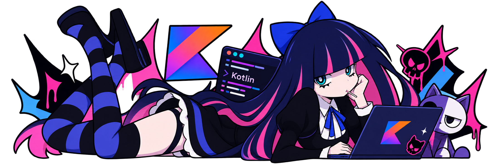

# 🌙 José V. 👾

---

## sobre mí

- 🎧 hago cosas en python y kotlin, sobre todo apps para android
- ✨ todo esto lo hago por diversión y para aprender, no me lo tomo muy en serio jaja
- 🔧 si algo se rompe, lo arreglo (o pregunto por ahí hasta que funcione)
- 🌸 fan del anime, y eso se nota hasta en mi perfil
- 📱 ando en tiktok mostrando lo que hago

---

## con qué trabajo

---

## stats

---

## mi actividad

---

## encuéntrame

*"el código no siempre compila a la primera, pero la vibra siempre está" 🌌*

